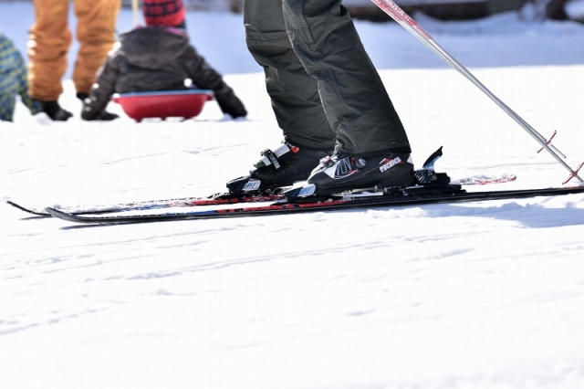
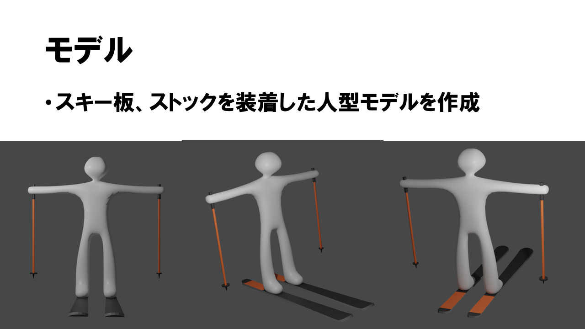
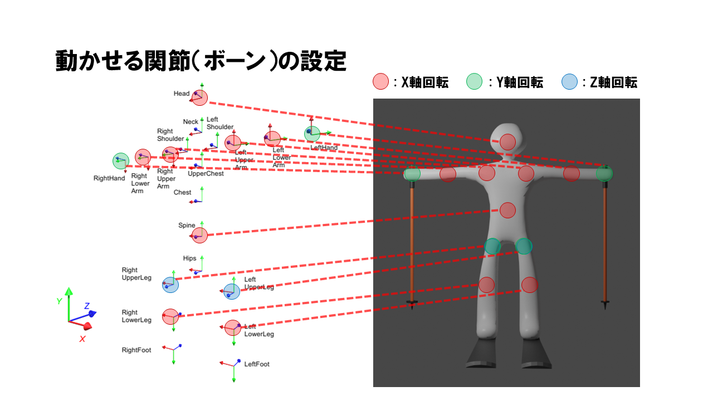
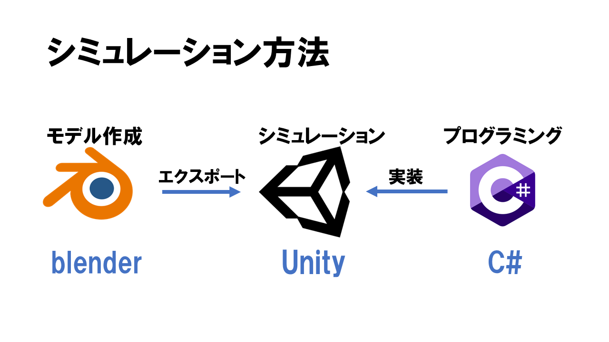
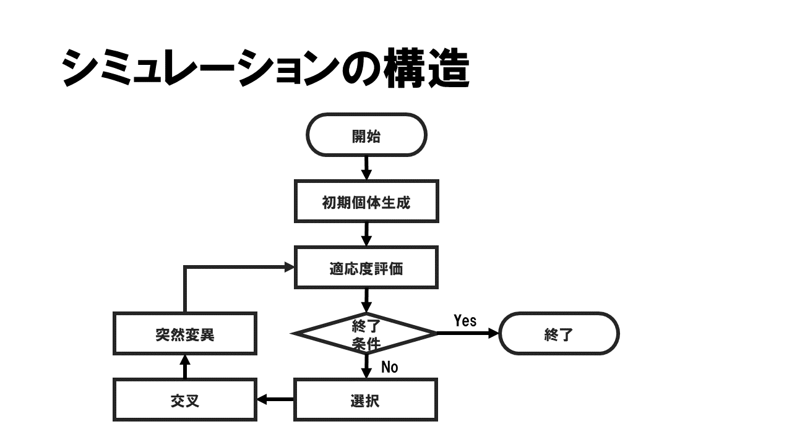
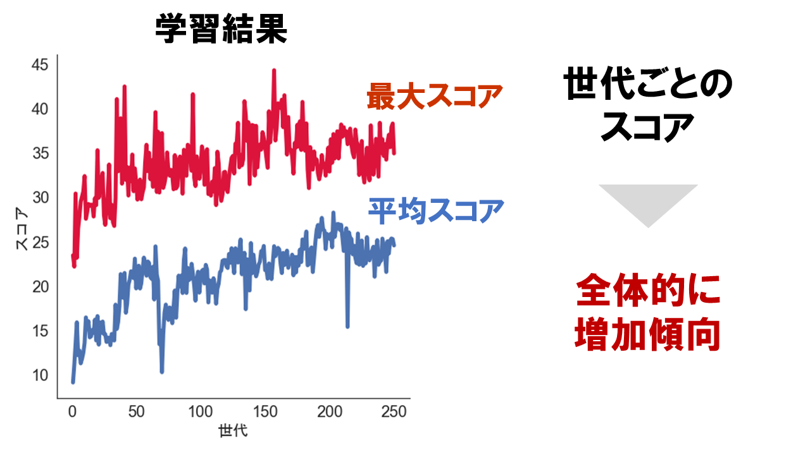

# GAでスキーのスケーティング学習
遺伝的アルゴリズム (Genetic Algorithm: GA)でスキー板を履いた人間の進行方法を学習させてみた.

## モデルの作成
スキー板を履いた人間の作成は3Dモデル作成ソフトの[Blender](https://www.blender.org/)を用いた. 私は3Dモデルに詳しい人間では無いのでご了承頂きたい. 
作成したモデル ↓

## シミュレーション方法
作成したモデルを使い, 物理エンジンの[Unity](https://unity.com/ja)上でシミュレーションを行う. 各世代に50個体を生成し, 一定時間内の進行距離に応じて個体の優劣を決める.

シミュレーションのフローチャート図も示しておく.

## 実験結果
250世代まで実験し, 移動距離に応じて定まるスコアを計算し, 各世代を評価. 下のグラフはその結果を表し, 世代が増えるほど平均スコア (青色) と各世代の最大スコア (赤色)の値を増加傾向にあることが分かった.

本リポジトリではシミュレーションに用いたソースファイルを載せています. より詳しい解説は, こちらのスライドを参照してほしい.